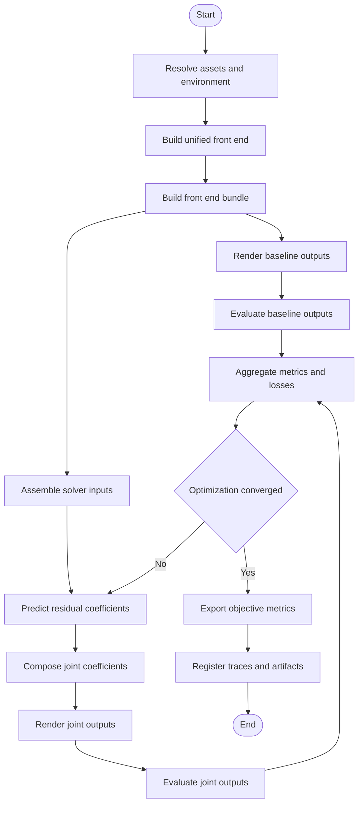

# Logical Flow

## Scope

- This logical flow fixes the accepted Phase 01 system for static, single-instance neural optimization of BSM coefficients.
- The flow assumes `Easycom + KU100`, a verified `bsm_harness_py311` environment, and a reusable BSM rendering front-end.

## System Flow

## Accepted Logic Layers

### 1. Asset And Environment Layer

- Resolve the external assets and dependency environment needed to reproduce the front-end and evaluation path.
- Treat imported open-source trees as read-only references.

### 2. Front-End Preparation Layer

- Build a unified front-end interface that exposes the core objects required downstream:
  - direction grid
  - array steering or rendering object `V`
  - target binaural response `h`
  - baseline coefficients `c_ls` and `c_magls`

### 3. Baseline Layer

- Reproduce `BSM-LS` and `BSM-MagLS` as objective baselines.
- Use `c_magls` as the default initializer for the learned residual path.

### 4. Learned Residual Layer

- The neural model operates in coefficient space only.
- It predicts `Delta c`, not binaural waveforms.
- The accepted update rule is `c_joint = c_magls + alpha * Delta c`.

### 5. Rendering And Loss Layer

- Render binaural outputs through the same BSM front-end used by the baselines.
- Compute the accepted Phase 01 objectives:
  - binaural magnitude error
  - binaural magnitude-derivative error
  - ERB-band ILD error
  - GCC-PHAT-style ITD proxy error
  - residual-size and smoothness regularization

### 6. Evaluation Closure Layer

- Compare the joint method against `BSM-MagLS` on static direction sets.
- Export objective summaries and optimization traces before any subjective stage is considered.

## Fixed Non-Goals In This Flow

- No end-to-end waveform predictor replaces the renderer.
- No dynamic yaw trajectory optimization is required in Phase 01.
- No multi-array generalization is assumed.
- No subjective listening workflow is part of the accepted core loop.
