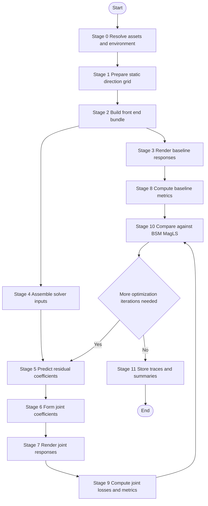

# Method Pipeline

## Pipeline Intent

- This pipeline expands the logical flow into the ordered processing stages expected in the Phase 01 implementation.

## Pipeline Diagram

## Stage Breakdown

### Stage 0. Resolve Assets And Environment

- Validate that the run is inside `bsm_harness_py311`.
- Resolve required external assets such as array transfer functions, KU100 HRIRs, and imported reference data.

### Stage 1. Prepare Static Direction Grid

- Define the Phase 01 direction set for static evaluation.
- Keep the grid deterministic so that baseline and joint methods are directly comparable.

### Stage 2. Build Front-End Bundle

- Produce the semantic bundle used by all later stages:
  - `grid`: static direction coordinates
  - `V`: array-side steering or forward model terms
  - `h`: target binaural transfer responses
  - `c_ls`: least-squares baseline coefficients
  - `c_magls`: magnitude-least-squares baseline coefficients

### Stage 3. Render Baseline Responses

- Render or evaluate the binaural output of `c_ls` and `c_magls`.
- Keep `BSM-MagLS` as the main reference for Phase 01 comparisons.

### Stage 4. Assemble Solver Inputs

- Feed the residual solver with `c_magls` and the accepted condition features.
- Condition features may include frequency index, direction metadata, or front-end descriptors, but they do not change the renderer semantics.

### Stage 5. Predict Residual Coefficients

- Use a residual MLP to produce `Delta c`.
- The prediction target is a correction in coefficient space, not a direct acoustic output.

### Stage 6. Form Joint Coefficients

- Apply the fixed update rule:
  - `c_joint = c_magls + alpha * Delta c`
- `alpha` remains a controlled scalar gate and may be part of ablation studies.

### Stage 7. Render Joint Binaural Responses

- Reuse the same BSM rendering front-end to evaluate `c_joint` on the static direction grid.

### Stage 8. Compute Baseline Reference Metrics

- Produce baseline-side objective summaries to anchor later comparison.

### Stage 9. Compute Joint Losses And Metrics

- Compute the accepted objective family:
  - magnitude mismatch
  - magnitude-derivative mismatch
  - ERB-band ILD mismatch
  - GCC-PHAT-style ITD proxy mismatch
  - residual regularization

### Stage 10. Compare Against `BSM-MagLS`

- Produce delta metrics and direction-wise summaries.
- The acceptance question is whether the joint method closes objective gaps without destabilizing the rendering path.

### Stage 11. Store Traces And Summaries

- Save convergence traces, per-loss values, metric summaries, and artifact references in experiment records.

## Expansion Points Reserved For Later

- Dynamic yaw conditioning
- Additional arrays or HRTFs
- Alternative ITD formulations beyond the initial GCC-PHAT proxy
- Subjective evaluation layers
